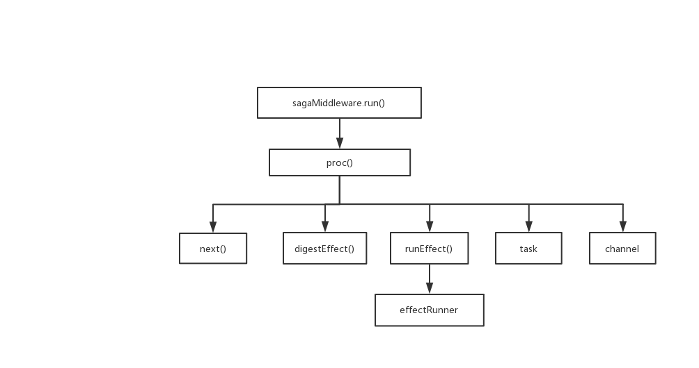

#### 写一个redux-saga-2：proc
这节来写proc。proc主要功能是执行iterator。我们将一个generator的运行用一个task对象来表示。proc运行返回值即为task，代表当前的saga任务。taks内部有个taskQueue队列，管理着当前主任务mainTask以及子任务（fork任务，后面会讲到）。每个saga运行后都会维护一个task树。

mainTask具有一个cont方法，mainTask结束或者运行出错时会执行cont方法，来将结束消息或者错误消息传递给task。


关于task，有以下几个特点：

- task是可取消的（调用task.cancel()方法）
- 父任务取消时会带着未完成的子任务一起取消
- 当task运行出错时，task会aborted，一个任务aborted，则其父任务也会aborted，兄弟任务也会aborted
- task可以被手动停止（调用task.end()方法）



iterator需要手动的去调用`iterator.next()`方法才会往下执行。同时，`iterator.next()`是可以传入参数的，传入的参数会被当作是上一个yield表达式的结果。例如：

```javascript
function* gen{
  let result =  yield 3;
  console.log(result);
}

let it = gen();
it.next(); // {value: 3, done: false}
it.next(4); // 4 {value: undefined, done: true}
```


为了满足iterator的运行，采用递归来消耗iterator。proc有个`next()`方法，该方法会被不断调用以来消耗iterator。

在generator中，`yield`语句后面可以跟普通方法、Promise、或者另一个generator方法。yield后面跟着的其实就是我们期望执行的副作用effect，每种effect都会有个对应的effectRunner来执行。

如果`yield`后面跟的依然是一个generator，那么需要运行这个generator并将返回的iterator传入proc，另起一个任务来执行这个generator。

```javascript
function* gen(){
  let result = yield subGen(); // 需要另起一个proc来执行subGen()返回的iterator
}
function* subGen(){
  let result = yield 4;
  return result
}
```

runner去执行对应effect之后，需要将执行结果返回，并继续执行主程序，所以effectRunner中需要传入一个cb（callback），来告诉effectRunner副作用执行完毕后该干啥。

effect和task 是可取消的，每个effectRunner需要给传入的cb设置一个cancel方法，告诉主任务如何取消当前的effect；每个task也都需要设置一个cancel方法，以便能够被取消。对于附属task，附属task需要将自己的取消方法设置给自己的主回调（mainCb）上。

需要注意一点，已完成的effect不能再取消，已取消的effect也不能再继续下去。在`digestEffect()`中我们会保证这个互斥关系。

```javascript
import effectRunner from './effectRunner.js'；
import deferred from  './utils/deferred';
import {is} from './utils/is';
import newTask from'./task';
import noop from './utils/noop';
import * as taskStatus from './utils/taskStatus'

/**
  iterator: 迭代器
  mainCb：当前任务完成后的回调
  name: generator的名字
*/
function proc(iterator, mainCb, name){
  
  let mainTask = {status: taskStatus.RUNNING, name};
  let def = deferred();
  let task = newTask(def, name, mainTask, mainCb);
  mainTask.cancel = function(){
    if(mainTask.status === taskStatus.RUNNING){
      mainTask.status = taskStatus.CANCELLED;
      next.cancel('cancel_task');
    }
  }
  next();
  return task
    
  function next(arg, isErr){
    try{
      let result;
      if(isErr){
        result = iterator.throw(arg);
      } else if(arg === 'cancel_task'){
        next.cancel(); // 任务在取消时同时要取消当前还在运行着的effect
        result = is.func(iterator.return) ? 
        iterator.return('cancel_task'): {value:'cancel_task'done: true}
      } else {
        result = iterator.next(arg);
      }
      if(!result.done){
        // TODO 根据result.value进行相应的操作
        digest(result.value, next)
      } else {
        // TODO 任务结束
        mainTask.cont();
      }      
    }catch(e){
      mainTask = taskStatus.ABORTED;
      mainTask.cont(e, true); // 任务出错时终止当前任务，并将错误信息向上传播
    }
  }
  
  function runEffect(effect, currCb){
    currCb.cancel = noop;
    //分情况处理effect：Promise, iterator, effect, 普通方法/变量
    if(is.iterator(effect)){
      proc(effect)
    } else (is.promise(effect)){
      effect.then(currCb, error => {
        currCb(error, true)
      })
    } else if(effect && effect.type) {
      let effectRunner = effectRunnerMap[effect.type]; // 选择runner执行effect
      effectRunner(effect, currCb)
    } else {
      currCb(effect)
    }
  }
  
  function digestEffect(effect, cb){
    let settled = false; // 如果当前effect已完成或者已取消则settled为true
    function currCb(res, isErr){
      if(settled){
        return
      }
      settled = true;
      cb.cancel = noop;
      cb(res, isErr)
    }
    cb.cancel = () => {
      if(settled){
        return
      }
      settled = true;
      currCb.cancel();
      currCb.cancel = noop;
    }
    runEffect(effect, currCb)
  }
}
```

本节代码地址：https://github.com/xusanduo08/easy-saga/tree/master/%E5%86%99%E4%B8%80%E4%B8%AAredux-saga-2