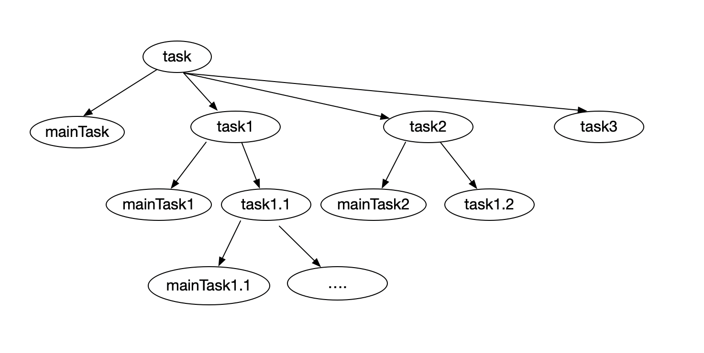

#### 写一个redux-saga-3：task

这一节来写一下task。

proc在运行一开始就会创建task，task是当前主任务mainTask以及分支任务的集合。task承担着当前任务的终止、取消、完成以及管理子任务等角色。

task的树形结构：



关于task，有以下几个特点：

- task是可取消的（调用task.cancel()方法）
- 父任务取消时会带着未完成的子任务一起取消
- 当task运行出错时，task会aborted，其父任务也会aborted，兄弟任务则会被取消
- task可以被手动停止（调用task.end()方法），此时，其下fork task不会受影响，依然能继续执行
- 一个task在结束之前，会等待其下所有分叉任务结束
- 来自子任务的错误会冒泡到父任务中
- task运行结束后，其运行结果会通过task自身携带的promise的resolve方法传递出去

要实现的功能：

* task可取消。取消一个task，会取消以这个task会根的task树
* task结束后，会自动将结果传递到父任务回调中，父任务继续执行
* 当前task出错，其下所有子task都会被取消，父任务会aborted，兄弟任务会被取消，并且错误会一直冒泡到最上面的任务

```javascript
export default function newTask(def, name, mainTask, cont){
  let status = taskStatus.RUNNING;
  let queue = forkQueue(mainTask, end);
  let taskResult;
  
  function end(result, isErr){
    if(!isErr){
      if(result === 'cancel_task'){
        status = taskStatus.CANCELLED
      } else if(status !== taskStatus.CANCELLED) {
        status = taskStatus.DONE
      }
      taskResult = result;
      def.resolve(result);
    } else {
      status = taskStatus.ABORTED;
      def.reject(result);
    }
    task.joiners.forEach(joiner => { // 执行等待该任务的回调
      joiner.cb(result)
    })
    task.joiners = [];
    task.cont(result, isErr);
  }
  
  function cancel(){
    if(status === taskStatus.RUNNING){
      queue.cancelAll();
      status = taskStatus.CANCELLED;
      end('cancel_task', false)
    }
  }
  
  const task = {
    name,
    cont,
    isRunning: () => status === taskStatus.RUNNING,
    isAborted: () => status === taskStatus.ABORTED,
    isCancelled: () => status === taskStatus.CANCELLED,
    joiners: [],
    end,
    queue,
    cancel,
    result: () => taskResult,
    toPromise: () => def.promise
  }
  return task
}

// 生成一个任务队列，在添加任务时自动给任务赋值cont方法
// 任务结束或者出错时会调用自身的cont方法通知父任务
function forkQueue(mainTask, end){
  let queue = [];
  let completed = false;
  let result;
  addTask(mainTask);
  
  function addTask(task){
    queue.push(task);
    task.cont = (res, isErr) => {
      if(completed){
        return
      }
      remove(queue, task); // 当前任务已执行过，从父任务队列中移除
      if(isErr){ // 执行当前任务时出错，取消所有兄弟任务，并将错误上报
        cancellAll();
        end(res, isErr)
      } else {
        if(task === mainTask){
          result = res;
        }
        // 正常情况下，当任务队列所有任务都完成时，主任务才能结束
        if(!queue.length){ 
          completed = true;
          end(result, true); // 调用主任务cont方法，上报任务执行结果
        }
      }
    }
  }
  
  function cancellAll(){
    if(completed){
      return
    }
    completed = true;
    queue.forEach(task => {
      task.cont = noop;
      task.cancel();
    })
    queue = [];
  }
  
  return {
    cancellAll,
    addTask
  }
}
```

