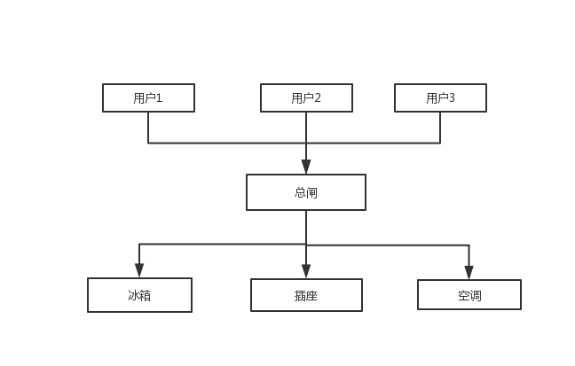

#### 门面模式

门面模式是对象的结构模式，外部与一个子系统的通信必须通过一个统一的门面对象进行。门面模式提供一个高层次的接口，使得子系统更易于使用。

子系统并不知道门面的存在，对子系统而言，门面只是另一个客户端的存在。

举个例子，每个人家里都会一个电源的集线盒，里面有好多开关，有控制插座的，有控制冰箱的，还有控制空调的，当然还有一个总闸，控制着家里的总电源。

有了这个总闸，当用户出去旅游需要关闭家里的电源时，就不需要去挨个关闭冰箱、空调、插座，只要关闭掉总闸就可以了，总闸会负责关闭所有用电器的电源。

这个总闸就相当于整个电源系统的门面。

##### 门面模式优缺点

优点：

* 对客户屏蔽子系统，减少了客户处理的对象数目并使得子系统使用起来更加容易。通过引入门面模式，客户端代码也会变得简单，与之关联的对象也很少

* 减少系统的相互依赖。使用门面模式，所有的依赖都是对门面对象的依赖，与子系统无关
* 实现了子系统与客户之间的松耦合，这使得子系统的变化不会影响到调用它的客户类，只需要调整外观即可
* 只是提供了一个访问子系统的统一入口，并不影响用户直接使用子系统类

缺点：

* 不符合开闭原则（对扩展开放，对修改关闭）。比如当有新电器加入时，门面对象相应的也要增加关闭新电器的功能

##### redux-saga中的门面模式

redux-saga内部由多个模块完成，proc，task，channel等等。在使用时，不需要手动去调用proc，task，channel等模块，只需要将写好的saga传入`sagaMiddleware.run()`即可，run方法会将运行saga并传入proc，然后做进一步处理。

`run()`方法的存在，对客户端而言，功能调用变得简单；对子系统而言，子系统只要保证对`run()`方法暴露的接口不改变即可，不存在子系统和客户端的耦合，减少了子系统和客户端的相互依赖性。